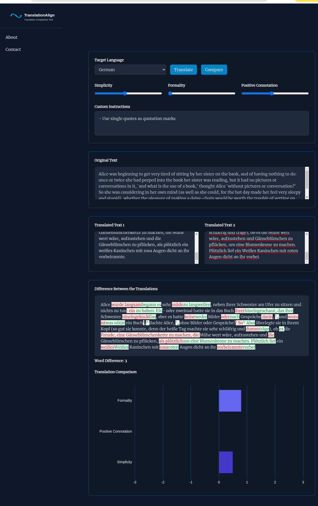

# TranslationAlign

TranslationAlign is a small tool for comparing translations and LLM-based guided translation. The main idea was:
- You can either two translations of a text or one translations and construct an LLM-based reference translation
- You can compare those two translations by:
	- creating diffs
	- give the diffs + the complete texts to the LLM to judge each of the differences and the overall difference with respect to different criteria like "Simplicity", "Formality", "Positive Connotation" (extensions would be possible).

